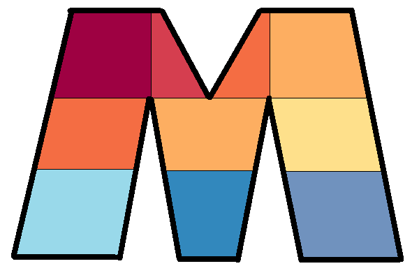
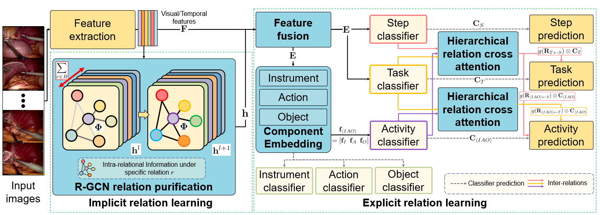
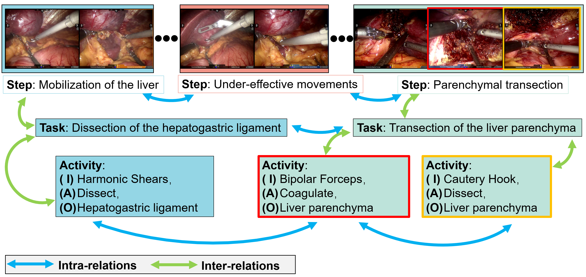

<!-- Improved compatibility of back to top link: See: https://github.com/othneildrew/Best-README-Template/pull/73 -->
<a name="readme-top"></a>
<!--
*** Thanks for checking out the Best-README-Template. If you have a suggestion
*** that would make this better, please fork the repo and create a pull request
*** or simply open an issue with the tag "enhancement".
*** Don't forget to give the project a star!
*** Thanks again! Now go create something AMAZING! :D
-->


<!-- PROJECT LOGO -->
<br />
<div align="center">
  <a href="https://github.com/Edwinzero-Miracle/MURPHY_v1">
    
  </a>

<h2 align="center">MURPHY: Relations Matter in Surgical Workflow Analysis</h2>

</div>

<div align="center">
  <a>
    
  </a>
</div>


Pytorch implementation of our multi-task relation purficiation hybrid (MURPHY) networks for hiearchical robotic left lateral sectionectomy (RLLS) surgical workflow analysis. 


<!-- GETTING STARTED -->
## Dataset

* We use the proposed  [RLLS12M](http://miraclelab.site/?page_id=2224) dataset. This is the first robotic left lateral sectionectomy (RLLS) dataset, with hierarchical annotation, addressing the lack of benchmark datasets for hierarchical surgical workflow analysis. This RLLS12M dataset contains abundant real-world scenarios, providing a new incubator for developing AI algorithms closer to the clinical environment.

<div align="center">
  <a >
    
  </a>
</div>

* 50 videos
* Step, Task, Activity Triplet <Instrument, Action, Object> 
* 12M annotation entities


## Setup and training

1. Check dependencies:
   ```
   - pytorch 1.7+
   - opencv-python
   - json
   - torchvision
   - PIL
   - pickle
   - sklearn
   ```
2. Clone this repo
    ```shell
    git clone https://github.com/Edwinzero-Miracle/MURPHY_v1
    ```

3. Training MURPHY

* Run ``bash train_murphy_rlls.sh`` to start the training of *RLLS* configuration. 
* Run ``bash train_murphy_rlls_rc.sh`` to start the training of *RLLS-w-RC* configuration

* Noe that The backbone can be selected by setting ``args.our_backbone`` to resnet50 or resnet50lstm.

4. Evaluation
* Execute ``python eval_murphy.py`` to evaluate MURPHY.


## Citation
If you find the code useful for your research, please cite:
```
@article{zhao2022murphy,
  title={MURPHY: Relations Matter in Surgical Workflow Analysis},
  author={Zhao, Shang and Liu, Yanzhe and Wang, Qiyuan and Sun, Dai and Liu, Rong and Zhou, S Kevin},
  journal={arXiv preprint arXiv:2212.12719},
  year={2022}
}
```


<!-- ACKNOWLEDGMENTS -->
<!-- ## Acknowledgments -->
<!-- 
* []()
* []()
* []() -->


<!-- MARKDOWN LINKS & IMAGES -->
<!-- https://www.markdownguide.org/basic-syntax/#reference-style-links -->
[contributors-shield]: https://img.shields.io/github/contributors/github_username/repo_name.svg?style=for-the-badge
[contributors-url]: https://github.com/github_username/repo_name/graphs/contributors
[forks-shield]: https://img.shields.io/github/forks/github_username/repo_name.svg?style=for-the-badge
[forks-url]: https://github.com/github_username/repo_name/network/members
[stars-shield]: https://img.shields.io/github/stars/github_username/repo_name.svg?style=for-the-badge
[stars-url]: https://github.com/github_username/repo_name/stargazers
[issues-shield]: https://img.shields.io/github/issues/github_username/repo_name.svg?style=for-the-badge
[issues-url]: https://github.com/github_username/repo_name/issues
[license-shield]: https://img.shields.io/github/license/github_username/repo_name.svg?style=for-the-badge
[license-url]: https://github.com/github_username/repo_name/blob/master/LICENSE.txt
[linkedin-shield]: https://img.shields.io/badge/-LinkedIn-black.svg?style=for-the-badge&logo=linkedin&colorB=555
[linkedin-url]: https://linkedin.com/in/linkedin_username
[product-screenshot]: images/screenshot.png
[Next.js]: https://img.shields.io/badge/next.js-000000?style=for-the-badge&logo=nextdotjs&logoColor=white
[Next-url]: https://nextjs.org/
[React.js]: https://img.shields.io/badge/React-20232A?style=for-the-badge&logo=react&logoColor=61DAFB
[React-url]: https://reactjs.org/
[Vue.js]: https://img.shields.io/badge/Vue.js-35495E?style=for-the-badge&logo=vuedotjs&logoColor=4FC08D
[Vue-url]: https://vuejs.org/
[Angular.io]: https://img.shields.io/badge/Angular-DD0031?style=for-the-badge&logo=angular&logoColor=white
[Angular-url]: https://angular.io/
[Svelte.dev]: https://img.shields.io/badge/Svelte-4A4A55?style=for-the-badge&logo=svelte&logoColor=FF3E00
[Svelte-url]: https://svelte.dev/
[Laravel.com]: https://img.shields.io/badge/Laravel-FF2D20?style=for-the-badge&logo=laravel&logoColor=white
[Laravel-url]: https://laravel.com
[Bootstrap.com]: https://img.shields.io/badge/Bootstrap-563D7C?style=for-the-badge&logo=bootstrap&logoColor=white
[Bootstrap-url]: https://getbootstrap.com
[JQuery.com]: https://img.shields.io/badge/jQuery-0769AD?style=for-the-badge&logo=jquery&logoColor=white
[JQuery-url]: https://jquery.com 